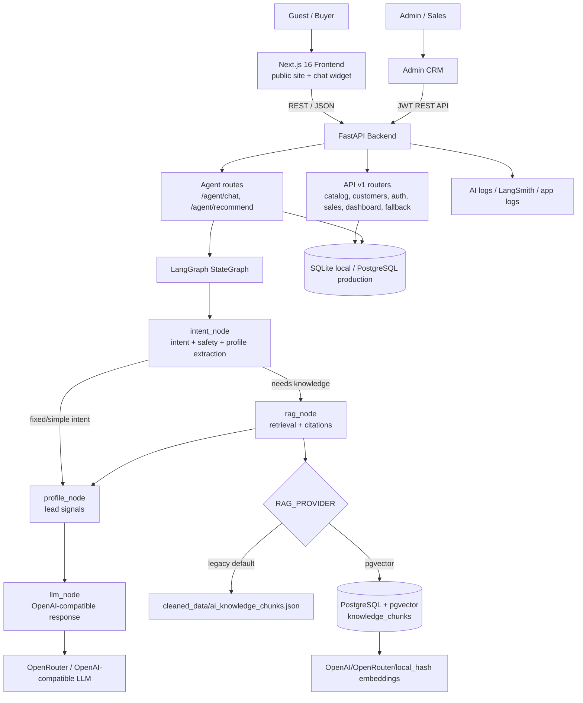
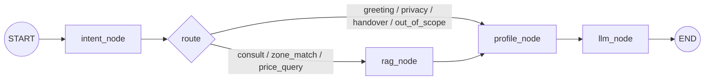
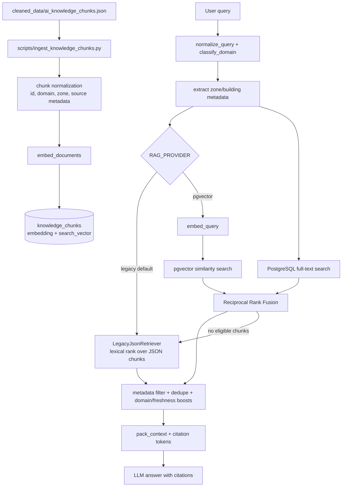

# ARCHITECTURE - Ocean Park AI Advisor

> File kiến trúc chính thức cho BTC chấm Demo Day. Bản Mermaid diagram phụ nằm tại `docs/architecture_diagram.md`.

## 1. System Overview

**Ocean Park AI Advisor** là AI pre-sales assistant cho Vinhomes Ocean Park. Hệ thống gồm public website, chat widget, FastAPI backend, LangGraph agent, RAG retrieval, database và CRM/admin dashboard.

## 2. Runtime Components

| Component | Technology | Responsibility |
|---|---|---|
| Public FE | Next.js 16, React 19, TypeScript, Tailwind CSS | Trang public, phân khu, chat widget, lead form |
| Admin CRM | Next.js admin routes | Customer list, conversations, sales assignment, fallback rules, dashboard |
| Backend API | FastAPI, SQLAlchemy, Alembic | Agent API, CRM API, auth, catalog, seed, migrations |
| AI Orchestration | LangGraph StateGraph | Điều phối intent, retrieval, profile scoring, LLM response |
| LLM | OpenRouter/OpenAI-compatible | Sinh câu trả lời cuối cùng |
| RAG Store | JSON fallback, PostgreSQL full-text, pgvector | Retrieval context và citations |
| Database | SQLite local, PostgreSQL production | users, customers, conversations, messages, CRM data |
| Observability | `.ai-log`, LangSmith/OpenRouter metadata, app logs | AI logs và evidence cho Demo Day |

## 3. LangGraph Flow

Node responsibilities:

- `intent_node`: phân loại intent, phát hiện prompt injection/off-topic/privacy/handover, trích xuất profile như budget, unit type, purpose, timeline.
- `rag_node`: tạo `RetrievalQuery`, gọi retriever, pack context, trả citations và recommended zones.
- `profile_node`: cập nhật tín hiệu lead, score/handover signal và dữ liệu CRM.
- `llm_node`: sinh câu trả lời cuối cùng từ state + RAG context + citations; dùng fixed response cho intent không cần LLM.

Đây là custom advisory graph, không phải ReAct tool loop thuần. Thiết kế này hợp với pre-sales assistant vì các bước safety, retrieval, lead scoring và response generation cần kiểm soát rõ.

## 4. RAG Architecture

RAG modes:

- `RAG_PROVIDER=legacy`: default local mode. Uses chunked JSON retrieval, context packing and citations. No semantic embedding required.
- `RAG_PROVIDER=pgvector`: standard RAG path: `chunk -> embed -> pgvector -> top-k -> context -> LLM`.
- `RAG_EMBEDDING_PROVIDER=local_hash`: deterministic smoke-test embedding, not semantic production embedding.
- `RAG_EMBEDDING_PROVIDER=openrouter/openai`: production-quality embedding path.

Important invariant: vectors stored in DB and query vectors must use the same embedding provider/model/dimension.

## 5. Data Flow

1. Guest opens chat. FE creates or reuses `session_id`.
2. FE sends `POST /agent/chat`.
3. Backend persists message and checks rate limit / lead gate / fallback rule.
4. If lead capture is required, backend returns `require_lead_capture=true` without calling LLM.
5. Otherwise LangGraph runs `intent -> rag -> profile -> llm`.
6. Response includes reply, citations, recommended zones, lead/handover signals and debug metadata.
7. Guest submits contact form through `POST /api/v1/customers/capture`.
8. CRM/Admin sees customer, transcript, lead score, notes and sales assignment.

## 6. Database And Persistence

| Store | Local | Production | Purpose |
|---|---|---|---|
| App DB | SQLite `app.db` | PostgreSQL | users, customers, conversations, messages, sales/admin data |
| RAG chunks | JSON fallback | PostgreSQL `knowledge_chunks` + pgvector | retrieval context and citations |
| Static data | `data/`, `cleaned_data/` | seeded/ingested data | catalog and knowledge source |
| Logs | local logs | AI log server / LangSmith | observability and evidence |

Main tables include:

- CRM/auth: `users`, `customers`, `customer_notes`, `conversations`, `messages`, `permissions`, `user_permissions`.
- Catalog: `subdivisions`, specs, amenities, policies.
- RAG production path: `knowledge_chunks`.

## 7. Security And Guardrails

- JWT auth protects admin/CRM APIs.
- Production config validation rejects unsafe JWT secret, default weak admin password, localhost CORS and non-PostgreSQL DB.
- Prompt injection/off-topic/privacy handling starts at `intent_node`.
- RAG responses use citations and avoid inventing live price/inventory.
- Price chốt/quỹ căn realtime should trigger Sales handoff unless trusted live data exists.
- Demo admin credential is documented for BTC only and should be rotated after judging.

## 8. Deployment

Live URLs:

- Public app: `https://c2-app-005.quangtm.site`
- Admin CRM: `https://c2-app-005.quangtm.site/admin/login`
- Demo admin account: `admin@gmail.com`
- Demo admin password: `admin123456789Aa@`

Production notes:

- Run Alembic migrations before production startup.
- Use PostgreSQL for production.
- Set `AUTO_CREATE_TABLES=false` in production.
- Use production HTTPS domain in `CORS_ORIGINS`.
- Rotate demo admin password after Demo Day.

## 9. Design Decisions

| Decision | Choice | Reason |
|---|---|---|
| User flow | Anonymous chat first, gated lead capture second | Better conversion and lower friction |
| Agent architecture | LangGraph 4-node custom advisory graph | Easier to test safety, RAG, scoring and response separately |
| Local RAG | `legacy` JSON chunks | Stable without PostgreSQL/API key |
| Production RAG | pgvector hybrid retrieval | Standard RAG with vector + lexical retrieval |
| CRM entity | Customer/lead in CRM with conversation transcript | Sales receives context, not only contact fields |
| Admin auth | JWT + permissions | Supports Sales/Admin roles and dashboard protection |
