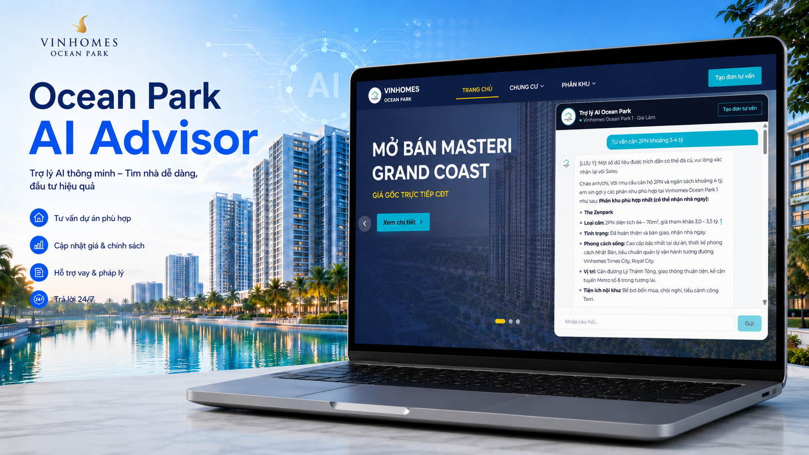

# Ocean Park AI Advisor


> Tóm tắt 1 câu: khách mua Vinhomes Ocean Park cần thông tin đáng tin và Sales cần lead có ngữ cảnh → **Ocean Park AI Advisor** dùng LangGraph + RAG để tư vấn, trích dẫn nguồn và chuyển lead sang CRM cho đội Sales.

## Vấn đề (Problem)

Khách quan tâm Vinhomes Ocean Park thường gặp 3 vấn đề chính:

- Thông tin phân khu, căn hộ, tiện ích, giá tham khảo và chính sách nằm rải rác ở nhiều nguồn, khó so sánh nhanh.
- Dữ liệu bất động sản dễ stale, đặc biệt là giá chốt và quỹ căn; chatbot nếu không có guardrail rất dễ trả lời thiếu căn cứ.
- Đội Sales thường nhận form liên hệ ngắn, thiếu transcript, thiếu nhu cầu, thiếu budget/timeline nên mất thời gian qualification lại từ đầu.

## Giải pháp (Solution)

**Ocean Park AI Advisor** là AI pre-sales assistant cho Vinhomes Ocean Park Gia Lâm:

- Chatbot tư vấn tự nhiên bằng tiếng Việt, ưu tiên trả lời dựa trên RAG context và citations.
- Luồng anonymous chat trước, gated lead capture sau `FREE_MESSAGE_LIMIT` hoặc khi khách chủ động muốn gặp Sales.
- LangGraph tách rõ các bước `intent_node`, `rag_node`, `profile_node`, `llm_node` để dễ kiểm thử và kiểm soát fallback.
- CRM/admin lưu customer, conversation, lead score, sales assignment và fallback rules để Sales tiếp tục chăm sóc.

## Target User

- Primary: khách mua/thuê/đầu tư căn hộ Vinhomes Ocean Park cần tư vấn nhanh về phân khu, loại căn, tiện ích, giá tham khảo và chính sách.
- Secondary: Sales/admin cần dashboard để xem lead, transcript, điểm tiềm năng và phân công follow-up.

## Mục lục

- [Bài Toán & Giải Pháp](#vấn-đề-problem)
- [Cấu Trúc Thư Mục Dự Án](#project-structure)
- [Danh Sách Biến Môi Trường](#danh-sách-biến-môi-trường-env)
- [Hướng Dẫn Thiết Lập & Khởi Chạy](#quick-start)
- [Quy Trình Kiểm Thử & Chất Lượng Code](#quality--testing)
- [Báo Cáo & Tài Liệu Bổ Sung](#báo-cáo--tài-liệu-bổ-sung-mvp-deliverables)
- [10 Deliverables BTC Yêu Cầu](#10-deliverables-btc-yêu-cầu)

## Tech Stack

| Layer | Technology |
|-------|------------|
| AI Agent | LangGraph StateGraph + OpenRouter/OpenAI-compatible LLM |
| Backend | FastAPI + Python 3.11+ + SQLAlchemy + Alembic |
| Frontend | Next.js 16 + React 19 + TypeScript + Tailwind CSS |
| Database | SQLite local / PostgreSQL production |
| RAG | JSON chunk fallback + PostgreSQL full-text search + pgvector |
| DevOps/Quality | Docker, GitHub Actions, Ruff, Pytest, Next.js build |

## Quick Start

```powershell
# 1. Clone repo
git clone https://github.com/AI20K-Build-Cohort-2/C2-App-005.git
cd C2-App-005

# 2. Create local env from template
Copy-Item .env.example .env

# 3. Build and run full stack with Docker Compose
docker compose up --build -d
```

Local URLs:

- Frontend: `http://localhost:3000`
- Backend API: `http://localhost:8000`
- Swagger: `http://localhost:8000/docs`
- Health check: `http://localhost:8000/health`

Useful Docker commands:

```powershell
docker compose ps
docker compose logs -f backend
docker compose logs -f frontend
docker compose down
```

Manual developer run, only if you do not use Docker:

```powershell
python -m venv .venv
.\.venv\Scripts\Activate.ps1
python -m pip install -e ".[dev]"
python -m uvicorn src.main:app --reload --host 0.0.0.0 --port 8000

cd FE
npm install
npm run dev
```

Live demo:

- Public app: `https://vsocintern.online`
- Admin CRM: `https://vsocintern.online/admin/login`
- Demo admin account: `admin@gmail.com`
- Demo admin password: `admin123456789Aa@`
- Video demo Google Drive: `https://drive.google.com/drive/folders/1I12vmhLrdAU4HzOzot6R_3IydwpIAieW`
- Pitch deck HTML: `presentation/pitch_deck.html`


Local admin seed dùng cùng email/password nếu chạy theo `.env.example`.

Local `.env` tối thiểu:

```env
APP_ENV=development
DATABASE_URL=sqlite:///./app.db
AUTO_CREATE_TABLES=true
AUTO_SEED_CATALOG=true

LLM_PROVIDER=openrouter
OPENROUTER_API_KEY=sk-or-v1-your-key
OPENROUTER_BASE_URL=https://openrouter.ai/api/v1
OPENROUTER_MODEL=deepseek/deepseek-chat

RAG_PROVIDER=legacy
CORS_ORIGINS=http://localhost:3000,http://127.0.0.1:3000
FREE_MESSAGE_LIMIT=3
```

## Danh Sách Biến Môi Trường (.env)

| Variable | Purpose | Local default/example |
|---|---|---|
| `APP_ENV` | Môi trường chạy app | `development` |
| `DATABASE_URL` | Kết nối database | `sqlite:///./app.db` local, PostgreSQL production |
| `AUTO_CREATE_TABLES` | Tự tạo bảng khi chạy local | `true` local, `false` production |
| `AUTO_SEED_CATALOG` | Seed dữ liệu catalog/admin | `true` |
| `LLM_PROVIDER` | Provider LLM OpenAI-compatible | `openrouter` |
| `OPENROUTER_API_KEY` | API key cho chat/embedding | set trong `.env`, không commit secret thật |
| `OPENROUTER_MODEL` | Chat model | `deepseek/deepseek-chat` |
| `RAG_PROVIDER` | Retrieval mode | `legacy` hoặc `pgvector` |
| `RAG_EMBEDDING_PROVIDER` | Embedding provider | `openrouter`, `openai`, `local_hash` |
| `CORS_ORIGINS` | Domain FE được phép gọi BE | localhost hoặc production URL |
| `FREE_MESSAGE_LIMIT` | Số tin miễn phí trước lead gate | `3` |
| `ADMIN_EMAIL` | Admin seed/demo account | `admin@gmail.com` |
| `ADMIN_PASSWORD` | Admin seed/demo password | `admin123456789Aa@` |

## Project Structure

```text
├── src/
│   ├── agents/          # LangGraph graph, state, nodes, tools
│   ├── api/             # FastAPI routes for agent, CRM, catalog, auth
│   ├── db/              # SQLAlchemy session, seed, permissions
│   ├── models/          # SQLAlchemy entities
│   ├── services/        # RAG, embeddings, LLM, lead scoring, data services
│   ├── config.py        # Pydantic Settings
│   └── main.py          # FastAPI app entry point
├── FE/                  # Next.js frontend
├── cleaned_data/        # Cleaned source data and AI knowledge chunks
├── migrations/          # Alembic migrations, including pgvector chunks
├── scripts/             # Ingest, verify, logging, preprocessing scripts
├── tests/               # Backend, API, RAG, LangGraph, E2E tests
├── ARCHITECTURE.md      # Official architecture document for BTC
├── docs/                # Deliverables, guide, reports, MVP docs
├── eval/                # Evaluation report and evidence
├── presentation/        # Pitch deck source
├── Dockerfile
├── docker-compose.yml
└── .github/workflows/   # CI/CD pipelines
```

## API Endpoints

| Method | Path | Description |
|--------|------|-------------|
| GET | `/health` | Health check |
| GET | `/ready` | DB readiness check |
| GET | `/api/v1/status` | API status |
| GET | `/api/v1/subdivisions` | Danh sách phân khu |
| GET | `/api/v1/subdivisions/{slug}` | Chi tiết phân khu |
| POST | `/agent/chat` | Chat với Ocean Park AI Advisor |
| POST | `/agent/recommend` | Gợi ý phân khu/căn hộ |
| POST | `/agent/customer-score` | Tính điểm khách hàng |
| POST | `/api/v1/customers/capture` | Capture lead/contact |
| POST | `/api/v1/auth/login` | Admin login |
| GET | `/api/v1/customers` | CRM customer list |
| GET | `/api/v1/dashboard/stats` | Dashboard metrics |
| GET | `/api/v1/fallback-rules` | Fallback rule management |

## RAG Và LangGraph

Local default dùng `RAG_PROVIDER=legacy` để chạy ổn định bằng `cleaned_data/ai_knowledge_chunks.json`. Đây vẫn là chunk-based RAG vì có retrieval, context packing và citation, nhưng chưa dùng semantic embedding.

Chế độ kỹ thuật đầy đủ dùng `RAG_PROVIDER=pgvector`:

```powershell
alembic upgrade head
python scripts\ingest_knowledge_chunks.py
$env:RAG_PROVIDER="pgvector"
$env:RAG_EMBEDDING_PROVIDER="openrouter"
python -m uvicorn src.main:app --reload
```

Pipeline pgvector: `chunk -> embed -> knowledge_chunks.embedding -> vector/full-text top-k -> Reciprocal Rank Fusion -> context + citations -> LLM`.

## Security scanning

Semgrep SAST và OWASP ZAP DAST chạy bằng Docker, xuất JSON khi chạy local và
SARIF trong GitHub Actions. Xem lệnh chạy và cấu hình tại
[`docs/security-scanning.md`](docs/security-scanning.md).

## Quality & Testing

```powershell
python -m ruff check src tests scripts
python -m compileall src scripts
python -m pytest tests -q

cd FE
npm.cmd run build
```

Latest local verification:

- Backend tests: `228 passed, 1 skipped`
- FE production build: pass
- Ruff: pass
- Compileall: pass

## Báo Cáo & Tài Liệu Bổ Sung (MVP Deliverables)

| Tài liệu | Vị trí / Link |
|---|---|
| Target User Personas (Đối tượng mục tiêu) | `docs/user_personas.md` |
| Product Scope Statement (Phạm vi dự án) | `docs/scope_statement.md` |
| MVP Demo Video | [Google Drive video + pitch deck](https://drive.google.com/drive/folders/1I12vmhLrdAU4HzOzot6R_3IydwpIAieW) |
| Pitch Deck | [Google Drive video + pitch deck](https://drive.google.com/drive/folders/1I12vmhLrdAU4HzOzot6R_3IydwpIAieW), `presentation/pitch_deck.html` |
| Báo cáo Thiết kế & Sơ đồ Kiến trúc | `ARCHITECTURE.md`, `docs/Report_MVP.md` |
| Bằng chứng Kiểm thử RAG Chatbot thực tế | `docs/Eval_Evidencies_MVP.md`, `docs/report_AI/RAG_CHATBOT_EVAL_EVIDENCE.md`, `eval/results/report.md` |
| Development Journal | `JOURNAL.md` |
| Worklog | `WORKLOG.md` |
| Final Deliverables Checklist | `docs/deliverables-final-checklist.md` |

## 10 Deliverables BTC Yêu Cầu

Đối chiếu theo `docs/guide/chapter-09.md`, repo đã có đủ 10/10 deliverables:

| # | Deliverable | Trạng thái | Vị trí / Bằng chứng |
|---|---|---|---|
| 1 | Source Code | Ready | `src/`, `FE/`, `tests/`, `scripts/`, `migrations/` |
| 2 | README.md | Ready | `README.md` |
| 3 | Architecture Diagram | Ready | `ARCHITECTURE.md` là file chính thức; `docs/architecture_diagram.md` là bản diagram phụ |
| 4 | AI Logs | Ready | `.ai-log/` support, `scripts/log_*.py`, LangSmith/OpenRouter metadata trong `.env.example` |
| 5 | Live URL | Ready | `https://vsocintern.online`; admin tại `https://vsocintern.online/admin/login` |
| 6 | Video Demo | Ready | [Google Drive video + pitch deck](https://drive.google.com/drive/folders/1I12vmhLrdAU4HzOzot6R_3IydwpIAieW) |
| 7 | Pitch Deck | Ready | [Google Drive video + pitch deck](https://drive.google.com/drive/folders/1I12vmhLrdAU4HzOzot6R_3IydwpIAieW), `presentation/pitch_deck.md` |
| 8 | Development Journal | Ready | `JOURNAL.md`, `docs/reportsDevOps` |
| 9 | Worklog | Ready | `WORKLOG.md` |
| 10 | Evaluation Evidence | Ready | `eval/results/report.md`, `docs/Eval_Evidencies_MVP.md`, `docs/report_AI/RAG_CHATBOT_EVAL_EVIDENCE.md`, `tests/` |

## Team

| Member | Role | Student ID |
|--------|------|------------|
| YenPhuong | AI/RAG/LangGraph/Evaluation | 2A202600616 |
| MinhQuang | FE/BE/CRM/API/Integration | 2A202600924 |

## License

MIT
