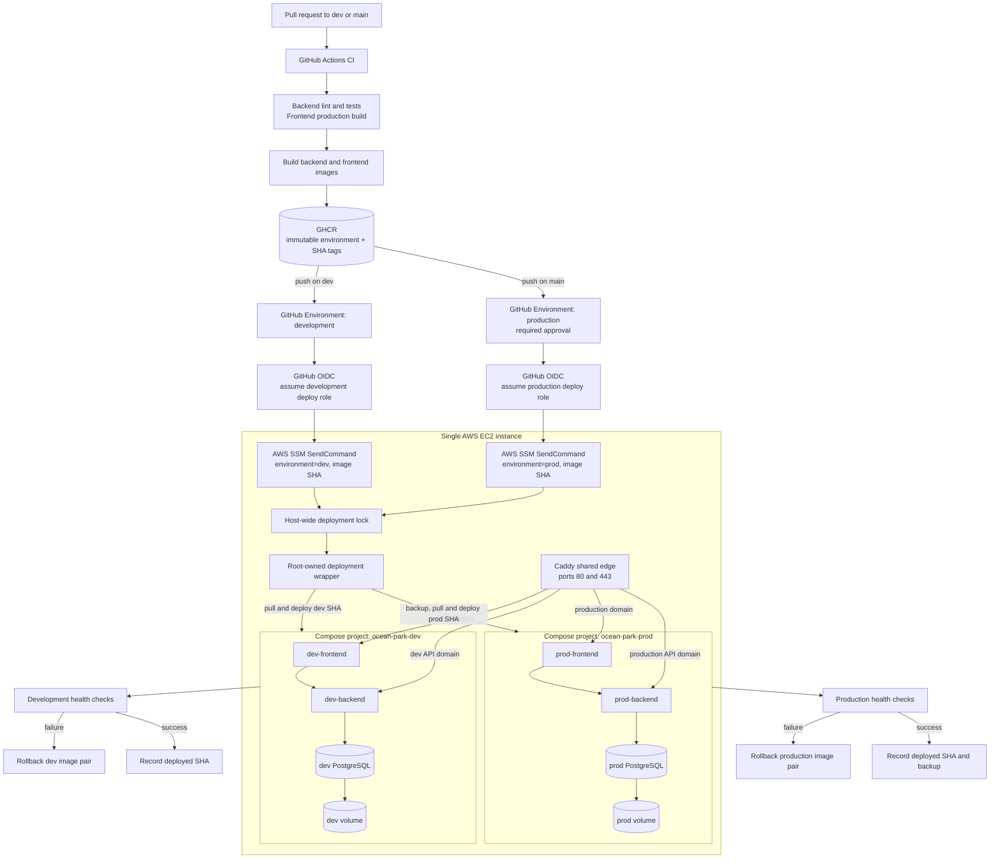

# Research Report: Technical

**Date:** 2026-07-21
**Author:** Cutie
**Research Type:** Technical

---

## Research Overview

This research evaluates a CI/CD architecture in which the repository's development and production environments share one AWS EC2 Docker host. It combines direct inspection of the existing FastAPI, Next.js, PostgreSQL, Docker Compose, Caddy, GHCR, backup, health-check, and rollback assets with current official guidance from AWS, GitHub, Docker, and Caddy.

The central finding is that one EC2 can support both environments for an MVP or low-criticality workload when they use separate Compose projects, networks, volumes, directories, environment files, image tags, and deployment identities behind one shared Caddy edge. GitHub OIDC and constrained Systems Manager documents remove the need for SSH keys or long-lived AWS credentials. This remains operational isolation rather than a security or availability boundary because the kernel, Docker daemon, storage, and host failure domain are shared. See **Research Synthesis** for the executive conclusions, decision criteria, roadmap, and migration triggers.

---

<!-- Content will be appended sequentially through research workflow steps -->

## Technical Research Scope Confirmation

**Research Topic:** Single-EC2 CI/CD pipeline for isolated development and production environments
**Research Goals:** Design and visualize a secure CI/CD pipeline where `dev` and `main` deploy isolated environments to one AWS EC2 instance while reusing the repository's existing Docker, GHCR, deployment, backup, and rollback assets.

**Technical Research Scope:**

- Architecture Analysis - design patterns, frameworks, system architecture
- Implementation Approaches - development methodologies, coding patterns
- Technology Stack - languages, frameworks, tools, platforms
- Integration Patterns - APIs, protocols, interoperability
- Performance Considerations - scalability, optimization, patterns

**Research Methodology:**

- Current web data with rigorous source verification
- Multi-source validation for critical technical claims
- Confidence level framework for uncertain information
- Comprehensive technical coverage with architecture-specific insights

**Scope Confirmed:** 2026-07-21

## Technology Stack Analysis

### Programming Languages

The application stack is already fixed by the repository and does not need a language migration for this deployment design. The backend uses Python 3.11 with FastAPI, Uvicorn, SQLAlchemy, Alembic, and Psycopg. The frontend uses TypeScript, Next.js 16, React 19, and Node.js 22. Bash provides the deployment, backup, health-check, and rollback automation executed on EC2.

_Popular Languages:_ Python for the API and AI/RAG services; TypeScript for the web application; Bash for host orchestration.

_Emerging Languages:_ No additional language is justified for this bounded infrastructure change.

_Language Evolution:_ Keep application code unchanged; concentrate change in declarative GitHub Actions YAML, Docker Compose YAML, Caddy configuration, IAM JSON, and small Bash wrappers.

_Performance Characteristics:_ Language runtime performance is not the principal constraint. On one EC2 instance, simultaneous image pulls, two PostgreSQL containers, application processes, Docker builds, and backups are the relevant CPU, memory, disk, and I/O risks. Docker image builds should remain on a CI runner rather than occur on the deployment EC2 host.

_Source: Repository `pyproject.toml`, `FE/package.json`, `Dockerfile`, and `FE/Dockerfile`._

### Development Frameworks and Libraries

The existing FastAPI/Uvicorn backend and Next.js standalone frontend are already containerized as non-root processes. Their current health endpoints and immutable container packaging are suitable for pull-and-recreate deployments. Pytest and Ruff provide backend CI gates, while `npm ci` and `npm run build` provide frontend dependency and compilation gates.

_Major Frameworks:_ FastAPI/Uvicorn for HTTP APIs; Next.js/React for the frontend; SQLAlchemy/Alembic for persistence and schema migrations.

_Micro-frameworks:_ No additional deployment framework is required. AWS CLI plus Systems Manager Run Command is sufficient for a single-host target.

_Evolution Trends:_ Preserve the existing application framework versions during the CI/CD change so deployment risk is not coupled to application upgrades.

_Ecosystem Maturity:_ All selected components have existing Docker images or build stages in the repository and are already exercised by the current CI workflow.

_Source: Repository `pyproject.toml`, `FE/package.json`, and `.github/workflows/ci.yml`._

### Database and Storage Technologies

The current deployment uses PostgreSQL 16 in Docker with a named `postgres_data` volume. Two environments on one EC2 require two different Compose project names, which scope the generated volume names and prevent development migrations or test data from touching production. This isolation is lost if both stacks explicitly map the volume to the same unscoped `name:` value.

_Relational Databases:_ Run one PostgreSQL container and one project-scoped volume per environment: for example, `ocean-park-dev_postgres_data` and `ocean-park-prod_postgres_data`.

_NoSQL Databases:_ Not required by the current application.

_In-Memory Databases:_ Not present and not required for this pipeline.

_Data Warehousing:_ Out of scope.

_Operational Storage:_ Production backup artifacts must be stored separately from development backups and copied off the EC2 root disk, preferably to a versioned S3 bucket. A single EC2 and a single EBS volume remain a shared failure domain even when Docker volumes are logically isolated.

_Source: [Docker Compose volumes](https://docs.docker.com/reference/compose-file/volumes/) and repository `deploy/compose/application.yml`._

### Development Tools and Platforms

GitHub Actions remains the CI/CD control plane. GHCR remains the image registry to minimize migration scope. GitHub Environments should represent `development` and `production`, with the production environment using branch restrictions and required approval where available. AWS authentication should use GitHub OIDC and short-lived role credentials rather than stored AWS access keys.

_IDE and Editors:_ Not relevant to runtime deployment.

_Version Control:_ GitHub branches `dev` and `main`; pull requests remain the quality boundary before branch deployment.

_Build Systems:_ GitHub Actions builds backend and frontend images once, publishes immutable `sha-*` tags, and passes the exact commit SHA to deployment.

_Testing Frameworks:_ Ruff, Pytest, and the Next.js production build are the existing gates. Post-deployment readiness probes provide a deployment gate but do not replace integration tests.

_Security Tooling:_ `aws-actions/configure-aws-credentials` exchanges GitHub OIDC tokens for temporary AWS credentials. Systems Manager removes the need to expose SSH or store an SSH private key in GitHub.

_Source: [GitHub OIDC with AWS](https://docs.github.com/en/actions/how-tos/secure-your-work/security-harden-deployments/oidc-in-aws) and [GitHub deployment environments](https://docs.github.com/en/actions/how-tos/deploy/configure-and-manage-deployments/control-deployments)._

### Cloud Infrastructure and Deployment

The target is one AWS EC2 instance acting as a shared Docker host. Docker Compose supports running the same application specification multiple times with distinct project names; Compose uses those names to group and isolate containers, default networks, and normally named volumes. The repository already passes `-p` in its deployment scripts, so the design should standardize on `ocean-park-dev` and `ocean-park-prod` and never reuse one project name for both.

Only one edge proxy can bind EC2 ports 80/443. A shared Caddy edge stack should route separate development and production hostnames to uniquely named upstreams. Each application stack should use distinct networks and must not expose PostgreSQL publicly. Development and production app ports should either remain internal on an explicitly shared edge network with unique aliases or bind only to loopback using non-overlapping host ports.

_Major Cloud Provider:_ AWS EC2 is the compute target; IAM/OIDC supplies temporary deployment identity; Systems Manager Run Command supplies remote command execution.

_Container Technologies:_ Docker Engine and Docker Compose are sufficient for one host. Kubernetes would add operational complexity without removing the single-host failure domain.

_Serverless Platforms:_ Out of scope.

_CDN and Edge Computing:_ Caddy handles TLS termination and reverse proxying on EC2. Cloudflare may remain in front if already configured, but origin routing must still distinguish development and production hostnames.

_Source: [Docker Compose project names](https://docs.docker.com/compose/how-tos/project-name/), [Docker Compose networking](https://docs.docker.com/compose/how-tos/networking/), and [Caddy reverse proxy](https://caddyserver.com/docs/caddyfile/directives/reverse_proxy)._

### Technology Adoption Trends

The relevant direction is credentialless CI federation, immutable image deployment, environment protection, and declarative host isolation. These are incremental extensions of the repository's existing toolchain rather than a platform migration.

_Migration Patterns:_ Keep GHCR initially; migrate to Amazon ECR only if eliminating the EC2-side GHCR credential becomes a priority. Keep Docker Compose while the workload remains a single host.

_Emerging Technologies:_ GitHub OIDC federation and SSM-based deployment improve secret handling without introducing a resident deployment agent beyond SSM Agent.

_Legacy Technology:_ Long-lived AWS access keys and permanent SSH private keys in GitHub Secrets should not be introduced.

_Community Trends:_ Environment-gated deployments and temporary cloud credentials are supported directly by GitHub and AWS documentation.

_Source: [GitHub OIDC with AWS](https://docs.github.com/en/actions/how-tos/secure-your-work/security-harden-deployments/oidc-in-aws)._

### Step 2 Assessment

- **High confidence:** Docker Compose project-name isolation, OIDC authentication, GitHub Environment controls, Caddy hostname routing, and reuse of the repository's existing image/deployment assets.
- **Medium confidence pending EC2 sizing data:** Whether one host has sufficient memory, disk, and I/O capacity for two application stacks and two PostgreSQL instances.
- **Material limitation:** Logical environment isolation does not provide host-level fault isolation. An EC2 outage, EBS failure, Docker daemon failure, disk exhaustion, or host compromise affects both environments.

## Integration Patterns Analysis

### API Design Patterns

The deployment control plane should be a narrow point-to-point integration rather than a new application API. GitHub Actions authenticates to AWS using OIDC, assumes a least-privilege IAM role, and calls Systems Manager `SendCommand`. The managed EC2 instance receives a small command that invokes a host-owned deployment wrapper with only two non-secret inputs: environment and immutable image version.

_RESTful APIs:_ Existing FastAPI REST endpoints remain unchanged. The `/ready` endpoint is the post-deployment backend contract.

_GraphQL APIs:_ Not required.

_RPC and gRPC:_ Not required for a single-host deployment control plane.

_Webhook Patterns:_ GitHub workflow events initiate CI/CD. Prefer deploy jobs in the existing CI workflow with `needs: docker-images` so the exact tested workflow run and commit SHA remain in one dependency graph. A separate `workflow_run` workflow is possible but adds event-context and privilege-boundary complexity.

_Source: [GitHub deployment environments](https://docs.github.com/en/actions/how-tos/deploy/configure-and-manage-deployments/control-deployments) and repository `.github/workflows/ci.yml`._

### Communication Protocols

The public data plane is HTTPS from users or Cloudflare to the single Caddy edge. Caddy terminates TLS and forwards HTTP over a Docker external network to environment-specific frontend and backend aliases. Internal PostgreSQL traffic stays on each environment's private Compose network.

The deployment control plane uses HTTPS for GitHub OIDC, AWS STS, Systems Manager APIs, and GHCR image pulls. SSM Agent receives Run Command through AWS-managed channels; port 22 does not need to be part of the automated deployment path.

_HTTP/HTTPS Protocols:_ HTTPS is mandatory at the public edge and for cloud-control APIs. Plain HTTP is acceptable only between Caddy and containers on the local Docker network.

_WebSocket Protocols:_ No new WebSocket dependency is introduced. If the application later uses WebSockets, Caddy's reverse proxy must preserve that behavior and deploy health checks should cover it.

_Message Queue Protocols:_ Not required.

_gRPC and Protocol Buffers:_ Not required.

_Source: [Caddy reverse proxy](https://caddyserver.com/docs/caddyfile/directives/reverse_proxy), [Caddy automatic HTTPS](https://caddyserver.com/docs/automatic-https), and [AWS Systems Manager Run Command](https://docs.aws.amazon.com/systems-manager/latest/userguide/running-commands.html)._

### Data Formats and Standards

GitHub workflow definitions, Docker Compose files, and application configuration use YAML or environment files. IAM trust and permission policies use JSON. AWS CLI responses are JSON and should be queried for `CommandId`, invocation status, standard output, and standard error. Image identity is a short immutable string derived from the full Git commit SHA, but the deployment audit record should retain the full SHA and image digest.

_JSON and YAML:_ Use structured AWS CLI output and declarative workflow/configuration files.

_Protobuf and MessagePack:_ Not required.

_CSV and Flat Files:_ `.env.dev` and `.env.prod` are local configuration files, not interchange formats. They must remain host-local with restrictive permissions.

_Custom Data Formats:_ Use fully qualified image references such as `ghcr.io/owner/repo-backend:dev-sha-abc1234` and store the previous successful pair for rollback.

_Source: Repository deployment scripts and [AWS Run Command status documentation](https://docs.aws.amazon.com/systems-manager/latest/userguide/monitor-commands.html)._

### System Interoperability Approaches

The recommended topology uses one shared external Docker network named `ocean-park-edge`. The Caddy service and only the frontend/backend services join this network. Databases remain exclusively on their environment-private networks. Each edge-facing service must have a unique network alias such as `dev-frontend`, `dev-backend`, `prod-frontend`, and `prod-backend`; Docker warns that resolution is not guaranteed when multiple containers share the same network-wide alias.

_Point-to-Point Integration:_ GitHub Actions to AWS SSM; Caddy to four uniquely named upstreams; each backend to only its own PostgreSQL service.

_API Gateway Patterns:_ Caddy is the shared ingress gateway, routing by hostname rather than path to keep environment boundaries clear.

_Service Mesh:_ Unnecessary on a single Docker host.

_Enterprise Service Bus:_ Unnecessary.

_Source: [Connecting multiple Compose projects](https://docs.docker.com/compose/how-tos/networking/), [Compose network aliases](https://docs.docker.com/reference/compose-file/services/), and [Compose networks](https://docs.docker.com/reference/compose-file/networks/)._

### Microservices Integration Patterns

_API Gateway Pattern:_ One Caddy instance owns ports 80/443 and defines four public host mappings, for example `dev.example.com`, `api-dev.example.com`, `example.com`, and `api.example.com`.

_Service Discovery:_ Docker DNS resolves unique aliases on the shared edge network. Environment-private service discovery continues to use `backend` and `database` within each separate project network.

_Circuit Breaker Pattern:_ Not required in the deployment workflow. Caddy passive/active health behavior and application retries may improve runtime resilience, but no redundant upstream exists on one EC2.

_Saga Pattern:_ Not applicable. Database migration and image update must be treated as an ordered deployment transaction with explicit failure handling.

_Source: [Caddy multiple-site concepts](https://caddyserver.com/docs/caddyfile/concepts) and [Docker Compose networking](https://docs.docker.com/compose/how-tos/networking/)._

### Event-Driven Integration

CI/CD is event-driven but does not need a message broker. Pull requests run validation without deployment. A successful push workflow on `dev` unlocks the development deployment job. A successful push workflow on `main` reaches the protected production environment and waits for approval before deploying.

_Publish-Subscribe Patterns:_ GitHub branch events feed workflow jobs.

_Event Sourcing:_ GitHub workflow history, CloudTrail, SSM command history, image metadata, and a host-local deployment ledger provide the audit trail.

_Message Broker Patterns:_ Not required.

_CQRS Patterns:_ Not applicable.

_Source: [GitHub deployment environments](https://docs.github.com/en/actions/how-tos/deploy/configure-and-manage-deployments/control-deployments) and [AWS Run Command history](https://docs.aws.amazon.com/systems-manager/latest/userguide/running-commands.html)._

### Integration Security Patterns

_OAuth 2.0 and JWT:_ GitHub issues an OIDC JWT for each eligible job; AWS validates its audience and subject before returning temporary role credentials.

_API Key Management:_ Do not place AWS access keys, database passwords, or application secrets in the SSM command string. AWS warns that Run Command activity is logged and plaintext sensitive parameters can be exposed through logs. Keep secrets in environment-local files with restrictive permissions or retrieve encrypted `SecureString` parameters on the instance.

_Mutual TLS:_ Not necessary between containers on the same host. TLS terminates at Caddy.

_Data Encryption:_ HTTPS protects public and cloud-control traffic. EBS encryption and encrypted off-host backups protect stored data.

_Privilege Boundary:_ A development container or deployment script with Docker socket/daemon authority can affect production on the same host. Therefore this design provides namespace and operational isolation, not a strong security boundary. Protect the `dev` branch and do not execute arbitrary branch-controlled shell as root. A root-owned deployment wrapper should accept allow-listed environment and image arguments.

_Source: [GitHub OIDC with AWS](https://docs.github.com/en/actions/how-tos/secure-your-work/security-harden-deployments/oidc-in-aws) and [AWS Run Command secret warning](https://docs.aws.amazon.com/systems-manager/latest/userguide/running-commands.html)._

### Single-EC2 CI/CD Integration Pipeline



### Deployment Handoff Contract

1. CI builds separate environment-qualified frontend image tags because `NEXT_PUBLIC_API_URL` is compiled into the current Next.js image. A plain shared `sha-*` tag can be overwritten if the same commit is built with different dev and production URLs; prefer `dev-sha-*` and `prod-sha-*`, or redesign frontend runtime configuration.
2. The deploy job sends only environment, full commit SHA, and image references/digests to SSM.
3. A host-wide lock serializes development and production mutations even if GitHub jobs overlap.
4. Separate directories such as `/opt/ocean-park/dev` and `/opt/ocean-park/prod` prevent branch checkouts and `.env` files from colliding. A shared working tree is forbidden.
5. The host-owned wrapper validates the environment, validates image-reference syntax, takes the lock, backs up production, writes the new image pair, runs the environment-specific Compose project, and executes health checks.
6. The workflow waits for the specific SSM command invocation and inspects its exit status and output. AWS notes that aggregate `Success` has nuances, so this design targets one explicit instance and makes the wrapper fail nonzero on any failed step.
7. On failure after mutation, the wrapper restores the previous image pair. Database migrations must be backward-compatible because reverting images cannot necessarily reverse a schema change.

_Source: [AWS CLI `command-executed` waiter](https://docs.aws.amazon.com/cli/latest/reference/ssm/wait/command-executed.html) and [AWS Run Command statuses](https://docs.aws.amazon.com/systems-manager/latest/userguide/monitor-commands.html)._

### Step 3 Assessment

- **High confidence:** The control-plane sequence, external edge-network pattern, unique aliases, environment-qualified image tags, and explicit SSM status handling.
- **High confidence:** A shared Git working directory and shared mutable image tags would create deployment races and must not be used.
- **Medium confidence:** A shared external Docker network is operationally clean, but it weakens network separation between edge-facing services. Loopback-bound non-overlapping ports are a viable alternative if simpler operations are preferred.
- **Material limitation:** Development code and production workloads share the Docker daemon, kernel, disk, instance role surface, and host availability. This architecture is appropriate for constrained MVP or demonstration use, not strong multi-environment isolation.

## Architectural Patterns and Design

### System Architecture Patterns

Use three independent Compose projects under `/opt/ocean-park`: `edge` for the only Caddy instance, `dev` for development, and `prod` for production. The edge project owns ports 80/443 and an external `ocean-park-edge` network. Only frontend and backend services join that external network using unique aliases; each PostgreSQL service remains on its environment-private network and volume.

This is a vertically scaled, shared-host modular architecture. Compose project names provide operational namespace isolation, but the EC2 kernel, Docker daemon, host filesystem, network interface, and EBS failure domain remain shared.

_Source: [Docker Compose project isolation](https://docs.docker.com/compose/how-tos/project-name/) and [Compose networks](https://docs.docker.com/reference/compose-file/networks/)._

### Design Principles and Best Practices

- One Caddy process exclusively owns ports 80/443.
- Use different Compose projects, directories, `.env` files, domains, networks, volumes, and environment-qualified image tags.
- Never share a mutable Git working tree between development and production.
- Deploy immutable images and retain the previous successful image pair.
- Keep deployment logic in a root-owned host wrapper that validates allow-listed parameters.
- Serialize host mutations with `/var/lock/ocean-park-deploy.lock`.
- Back up production before migration or container replacement.
- Never automatically promote a development deployment to production.

Suggested host layout:

```text
/opt/ocean-park/edge
/opt/ocean-park/dev
/opt/ocean-park/prod
/etc/ocean-park/dev.env
/etc/ocean-park/prod.env
/usr/local/sbin/ocean-park-deploy
/var/lock/ocean-park-deploy.lock
/var/lib/ocean-park/deployments/dev.json
/var/lib/ocean-park/deployments/prod.json
/var/backups/ocean-park/postgres
```

_Source: [Use Compose in production](https://docs.docker.com/compose/how-tos/production/)._

### Scalability and Performance Patterns

The single-host design scales vertically. Development activity can degrade production through shared CPU, memory, block I/O, network, and Docker operations. Docker containers have no resource constraints by default, and uncontrolled memory pressure can cause the Linux OOM killer to terminate containers or important host processes.

Give Caddy and production PostgreSQL the highest priority, production application services higher allowances, and development services strict CPU and memory ceilings. Serialize image pulls, backups, and deployment mutations. A provisional starting point is 4 vCPU and 8 GiB RAM, but this is a planning assumption rather than validated sizing; measure `docker stats`, PostgreSQL load, traffic, disk growth, and backup duration before production acceptance.

_Source: [Docker resource constraints](https://docs.docker.com/engine/containers/resource_constraints/) and [Compose deploy resources](https://docs.docker.com/reference/compose-file/deploy/)._

### Integration and Communication Patterns

Use one GitHub dependency graph: test, build, publish, then branch-specific deployment. `dev` enters the development GitHub Environment and assumes a development OIDC role. `main` enters a protected production GitHub Environment, waits for approval, and assumes a production OIDC role. Each role may invoke only its environment-specific custom SSM document, which calls the fixed host wrapper.

Avoid granting either workflow arbitrary `AWS-RunShellScript` authority. The custom documents should accept only environment-appropriate image identifiers and enforce fixed execution logic.

_Source: [GitHub deployment environments](https://docs.github.com/en/actions/how-tos/deploy/configure-and-manage-deployments/control-deployments) and [AWS Run Command](https://docs.aws.amazon.com/systems-manager/latest/userguide/running-commands.html)._

### Security Architecture Patterns

This layout provides operational separation, not a strong security boundary. A development workload or deployer with Docker daemon authority can potentially affect production. Protect `dev` and `main`, never mount the Docker socket into application containers, do not execute branch-controlled scripts as root, validate image inputs, keep secrets out of SSM command parameters, and preserve the non-root application containers already defined by the repository.

Separate GitHub Environments and IAM roles improve control-plane authorization but cannot provide host isolation. Teams that do not mutually trust all development deployers should not use this single-EC2 pattern.

_Source: [AWS Run Command security considerations](https://docs.aws.amazon.com/systems-manager/latest/userguide/walkthrough-cli.html) and [GitHub OIDC with AWS](https://docs.github.com/en/actions/how-tos/secure-your-work/security-harden-deployments/oidc-in-aws)._

### Data Architecture Patterns

Run separate PostgreSQL instances and project-scoped volumes such as `ocean-park-dev_postgres_data` and `ocean-park-prod_postgres_data`. Production protection includes pre-deploy `pg_dump`, off-host backup transfer, scheduled EBS snapshots, periodic restore tests, and backward-compatible migrations.

AWS documents that application-consistent EBS snapshots for self-managed PostgreSQL require coordinated pre/post scripts to flush or freeze I/O. Raw snapshots taken during writes should not be treated as proven application-consistent backups.

_Source: [AWS application-consistent EBS backups](https://docs.aws.amazon.com/ebs/latest/userguide/automate-app-consistent-backups.html) and [PostgreSQL backups on EC2](https://docs.aws.amazon.com/whitepapers/latest/optimizing-postgresql-on-ec2-using-ebs/postgresql-backups.html)._

### Deployment and Operations Architecture

For the MVP, recreate only the affected environment's containers, execute readiness checks, and roll back the previous image pair on failure. The other environment remains running. This accepts a brief interruption in the deployed environment. Blue/green deployment is deferred because it temporarily doubles application resource use and complicates schema migration on an already shared host.

Maintain CloudTrail, GitHub workflow history, SSM invocation output, immutable image metadata, and a host deployment ledger. Test production backup restoration periodically. The single EC2 remains a single point of failure and does not satisfy high-availability requirements.

_Source: [AWS Reliability Pillar](https://docs.aws.amazon.com/wellarchitected/latest/reliability-pillar/welcome.html) and [AWS Run Command status monitoring](https://docs.aws.amazon.com/systems-manager/latest/userguide/monitor-commands.html)._

### Step 4 Architecture Decision

Adopt the one-EC2 architecture only for a constrained MVP, demonstration, or low-criticality workload where all deployers are trusted. Establish an explicit migration trigger to separate EC2 instances or managed services when uptime, security isolation, resource contention, or recovery objectives become stricter.

## Implementation Approaches and Technology Adoption

### Technology Adoption Strategies

Adopt incrementally: preserve the working CI, extract the shared Caddy edge, validate two isolated Compose projects manually, automate development, observe resource and rollback behavior, then enable gated production. Do not combine EC2 provisioning, Compose restructuring, IAM/OIDC, production automation, and database changes into one release.

_Source: [AWS Reliability Pillar](https://docs.aws.amazon.com/wellarchitected/latest/reliability-pillar/welcome.html)._

### Development Workflows and Tooling

Pull requests run lint, tests, and frontend compilation without deployment. A push to `dev` builds `dev-sha-*` images and deploys through the development GitHub Environment. A push to `main` builds `prod-sha-*` images and waits at the protected production Environment before deployment.

Use one repository-wide concurrency group, `ocean-park-single-ec2-deployment`, with `cancel-in-progress: false`, plus the host-side lock. Keep the existing self-hosted CI runner on a separate machine; never install it on the production EC2 because pull-request code would then execute within the production host's trust boundary.

Proposed repository structure:

```text
.github/workflows/ci.yml
.github/workflows/cd-single-ec2.yml
deploy/caddy/Caddyfile.single-ec2
deploy/compose/edge.yml
deploy/compose/application.yml
deploy/aws/github-oidc-development-trust.json
deploy/aws/github-oidc-production-trust.json
deploy/aws/ssm-deploy-development.yaml
deploy/aws/ssm-deploy-production.yaml
scripts/deploy/ec2_deploy.sh
scripts/deploy/verify_single_ec2.sh
docs/deployment/aws-single-ec2-runbook.md
```

_Source: [GitHub deployment controls](https://docs.github.com/en/actions/how-tos/deploy/configure-and-manage-deployments/control-deployments)._

### Testing and Quality Assurance

Validate Compose configuration, volume/network names, public port exposure, cross-environment non-interference, host and GitHub locking, SSM failure propagation, health-check rollback, pre-migration backup, database restore, EC2 reboot recovery, disk/OOM alarms, absence of secrets in logs, and environment-specific frontend API URLs. Deliberately deploy a broken development image to prove rollback before enabling production CD.

### Deployment and Operations Practices

Create two custom SSM command documents that invoke the fixed host wrapper. Use strict `allowedPattern` validation and environment-variable interpolation for image parameters. The development IAM role can invoke only the development document; the production role can invoke only the production document.

Monitor EC2 CPU, host memory, disk free/used, Docker daemon health, container restart counts, application readiness, external HTTPS, backup age, SSM failures, Caddy 5xx responses, and certificate renewal. The CloudWatch Agent is required for host memory and detailed disk metrics beyond standard EC2 metrics.

_Source: [SSM document parameter validation](https://docs.aws.amazon.com/systems-manager/latest/userguide/documents-syntax-data-elements-parameters.html) and [CloudWatch Agent metrics](https://docs.aws.amazon.com/AmazonCloudWatch/latest/monitoring/metrics-collected-by-CloudWatch-agent.html)._

### Team Organization and Skills

The team needs GitHub Actions, IAM/OIDC, SSM, Docker Compose, Caddy, PostgreSQL backup/restore, CloudWatch, and incident rollback skills. Production approval and database recovery must not depend on one individual. Branch protection should ensure all people able to deploy development are trusted with the shared host.

### Cost Optimization and Resource Management

Cost centers are EC2, EBS and snapshots, S3 backups, CloudWatch metrics/logs/alarms, data transfer, optional Elastic IP, and GHCR storage/transfer. Apply Docker log rotation, GHCR image retention, safe Docker layer cleanup, S3 lifecycle rules, bounded CloudWatch retention, and EBS growth monitoring. Stop development services outside working hours only after startup and recovery behavior are proven.

### Risk Assessment and Mitigation

| Risk | Severity | Mitigation |
|---|---:|---|
| EC2 failure affects both environments | Critical | AWS Backup/EBS snapshots and tested rebuild runbook |
| Development compromises production host | Critical | Trusted deployers, fixed SSM documents, no Docker socket mounts |
| Migration breaks rollback | Critical | Backward-compatible migrations and verified backup |
| Disk exhaustion | High | Alarms, retention, log rotation |
| Memory pressure/OOM | High | Container limits and measured headroom |
| Shared checkout collision | High | Separate directories and immutable host wrapper |
| Concurrent deployment collision | High | GitHub concurrency plus host lock |
| Frontend image-tag collision | High | Environment-qualified SHA tags |
| Secret leakage through SSM logs | High | Never pass secrets as command parameters |
| Unrestorable backup | High | Scheduled restore tests |

_Source: [AWS restore guidance](https://docs.aws.amazon.com/prescriptive-guidance/latest/backup-recovery/restore.html) and [AWS Backup restore testing](https://docs.aws.amazon.com/aws-backup/latest/devguide/restore-testing.html)._

## Technical Research Recommendations

### Implementation Roadmap

1. **Baseline:** Measure EC2 resources and traffic, define RPO/RTO, verify SSM, and prove backup restoration.
2. **Repository restructuring:** Extract edge Caddy, parameterize the app stack, add unique resource names and limits.
3. **AWS control plane:** Configure OIDC roles, constrained SSM documents, CloudTrail, CloudWatch Agent, and alarms.
4. **Development CD:** Automate `dev-sha-*`, test broken deployments, locking, rollback, and production non-interference.
5. **Production CD:** Add approval where supported, deploy `prod-sha-*`, and verify backup/health/audit behavior.
6. **Recovery validation:** Test PostgreSQL and EC2/EBS recovery and record actual RPO/RTO.

### Technology Stack Recommendations

Retain GitHub Actions, GHCR, Docker Compose, Caddy, PostgreSQL 16, existing FastAPI/Next.js images, AWS IAM OIDC, Systems Manager, CloudWatch Agent, EBS snapshots/AWS Backup, and S3 off-host database dumps. Defer Kubernetes, ECS, RDS, and ECR migration until a specific isolation, availability, or credential-management requirement justifies them.

### Skill Development Requirements

Document and rehearse environment protection, OIDC trust policies, least-privilege SSM permissions, Compose network debugging, PostgreSQL restore, image rollback, CloudWatch alarm response, and complete EC2 rebuild.

### Success Metrics and KPIs

- CI and deployment success rates
- Deployment duration and change failure rate
- Mean time to rollback
- Production availability during development deployment
- CPU, memory, disk, and EBS headroom
- Backup age and restore success rate
- Measured RPO and RTO
- Deployments requiring SSH: target zero
- Long-lived AWS credentials in GitHub: target zero

### Step 5 Adoption Decision

Proceed only after manual coexistence, rollback, and restore tests pass. Automate development first and treat production automation as a separate acceptance gate.

## Research Synthesis

# One Host, Two Environments: Comprehensive Single-EC2 CI/CD Technical Research

## Executive Summary

A single AWS EC2 instance can host development and production for this repository using three Docker Compose projects: a shared Caddy edge, an isolated development application stack, and an isolated production application stack. The application stacks use separate PostgreSQL containers and volumes, private networks, configuration files, deployment directories, domains, and environment-qualified immutable image tags. GitHub Actions authenticates to AWS through OIDC and invokes environment-specific Systems Manager documents, which call a root-owned, allow-listed deployment wrapper on the host.

The architecture deliberately reuses the repository's existing strengths: CI validation, GHCR image publishing, container health checks, PostgreSQL backup, migration, rollback, and HTTPS configuration. The principal engineering work is not a platform rewrite; it is removal of shared mutable state, extraction of the Caddy edge, creation of constrained deployment contracts, resource governance, and validation of recovery procedures.

The design is suitable only for an MVP, demonstration, or low-criticality workload. Compose namespaces do not isolate the EC2 kernel, Docker daemon, host filesystem, storage device, instance role surface, or availability. Development deployers must be trusted with the shared host, and an EC2 outage or host compromise affects both environments. AWS reliability guidance recommends tested recovery and horizontal distribution when stronger availability is required.

**Key Technical Findings:**

- One shared Caddy edge must exclusively own ports 80/443.
- `ocean-park-dev` and `ocean-park-prod` must have independent networks, volumes, directories, `.env` files, and image references.
- The current frontend build embeds `NEXT_PUBLIC_API_URL`, so image tags must include the target environment as well as the commit SHA.
- GitHub OIDC plus constrained custom SSM documents is safer than SSH keys, long-lived AWS credentials, or arbitrary `AWS-RunShellScript` access.
- GitHub concurrency and a host-wide lock are both required to serialize mutation of one EC2 host.
- A GitHub self-hosted runner must not run on the deployment EC2.
- Development container CPU and memory need strict ceilings so resource pressure cannot casually starve production.
- Production database backup and restore testing are acceptance gates, not post-launch enhancements.

**Technical Recommendations:**

1. Preserve the working CI and implement CD incrementally.
2. Extract Caddy into a shared edge project and parameterize one application Compose model for dev/prod.
3. Use environment-specific OIDC roles and SSM documents with strict parameter patterns.
4. Automate development first; enable production only after coexistence, rollback, and restore tests pass.
5. Define explicit migration triggers for separate EC2 instances, RDS, ECS, or another managed target.

## Table of Contents

1. [Technical Research Introduction and Methodology](#1-technical-research-introduction-and-methodology)
2. [Technical Landscape and Architecture Analysis](#2-technical-landscape-and-architecture-analysis)
3. [Implementation Approaches and Best Practices](#3-implementation-approaches-and-best-practices)
4. [Technology Stack Evolution and Current Trends](#4-technology-stack-evolution-and-current-trends)
5. [Integration and Interoperability Patterns](#5-integration-and-interoperability-patterns)
6. [Performance and Scalability Analysis](#6-performance-and-scalability-analysis)
7. [Security and Governance Considerations](#7-security-and-governance-considerations)
8. [Strategic Technical Recommendations](#8-strategic-technical-recommendations)
9. [Implementation Roadmap and Risk Assessment](#9-implementation-roadmap-and-risk-assessment)
10. [Future Technical Outlook and Migration Triggers](#10-future-technical-outlook-and-migration-triggers)
11. [Research Methodology and Source Verification](#11-research-methodology-and-source-verification)
12. [Technical Appendices and Reference Materials](#12-technical-appendices-and-reference-materials)

## 1. Technical Research Introduction and Methodology

### Technical Research Significance

Sharing one EC2 reduces infrastructure count and preserves a simple Compose operating model, but it concentrates operational and security risk. The research therefore treats low cost and reuse as constraints rather than evidence of production suitability. Docker documents single-server Compose as the simplest deployment path, while AWS reliability principles emphasize tested recovery, automated change, measured capacity, and horizontal distribution to reduce shared failure points.

_Technical Importance:_ The design must prevent environment collisions without pretending namespace separation equals host isolation.

_Business Impact:_ It enables a lower-cost MVP deployment while making the conditions for future infrastructure separation explicit.

_Sources: [Docker Compose in production](https://docs.docker.com/compose/how-tos/production/) and [AWS reliability design principles](https://docs.aws.amazon.com/wellarchitected/latest/framework/rel-dp.html)._

### Technical Research Methodology

- **Scope:** CI/CD control plane, Docker isolation, ingress, data, security, capacity, observability, rollback, and recovery.
- **Repository evidence:** Existing workflows, Dockerfiles, Compose definitions, Caddy configuration, scripts, runbooks, and application manifests.
- **Primary sources:** Current AWS, GitHub, Docker, and Caddy documentation.
- **Analysis framework:** Existing-state inspection, integration-contract analysis, failure-domain analysis, phased adoption, and risk-based acceptance gates.
- **Time period:** Current as of 2026-07-21.
- **Confidence:** High for platform behavior; medium for capacity because no production load measurements or EC2 specification were supplied.

### Technical Research Goals and Objectives

The research goal was to design and visualize a secure pipeline where `dev` and `main` deploy isolated environments to one EC2 while reusing existing assets. This objective was achieved through the integration diagram, host layout, environment contracts, deployment controls, test plan, roadmap, and migration criteria documented above.

## 2. Technical Landscape and Architecture Analysis

### Current Technical Architecture

The application is a containerized Python 3.11/FastAPI backend, Next.js/React frontend, and PostgreSQL 16 database. Existing GitHub Actions validates backend/frontend code and publishes GHCR images. Existing deployment scripts already perform Compose validation, image pulls, migrations, readiness checks, production backup, and rollback.

The target architecture adds a shared edge Compose project and runs the application Compose specification twice using distinct project names. Compose project names group and isolate default resources; an explicit external edge network permits Caddy to reach uniquely aliased frontend/backend services across projects.

_Sources: [Compose project names](https://docs.docker.com/compose/how-tos/project-name/) and [Compose networking](https://docs.docker.com/compose/how-tos/networking/)._

### Architectural Trade-offs

| Quality | Benefit | Limitation |
|---|---|---|
| Cost | One compute instance | Shared failure domain |
| Simplicity | Retains Docker Compose | Host operations remain self-managed |
| Isolation | Separate app namespaces and data | Shared kernel and Docker daemon |
| Delivery | Automated branch deployments | Must serialize host mutations |
| Recovery | Existing backup/rollback reusable | Image rollback cannot reverse incompatible schema changes |
| Growth | Vertical resizing available | No host-level high availability |

## 3. Implementation Approaches and Best Practices

Use a six-phase implementation: baseline and recovery proof, repository restructuring, AWS control plane, development automation, production automation, and recovery validation. Every phase has a reversible boundary. Production CD is enabled only after development demonstrates stable coexistence and deliberate failure rollback.

The host-owned wrapper is the central enforcement point. It validates the requested environment and image names, takes a global lock, loads the environment-local configuration, performs production backup when applicable, writes the new image pair, validates Compose, pulls images, updates only the selected project, runs health checks, records success, and restores the previous image pair on failure.

## 4. Technology Stack Evolution and Current Trends

No application-stack migration is needed. The incremental additions are GitHub Environments, OIDC federation, custom SSM documents, a shared Compose network, environment-qualified image metadata, CloudWatch Agent metrics, and off-host backup retention. This favors short-lived credentials and immutable deployment artifacts without adding an orchestrator that cannot remove the underlying single-host limitation.

Amazon ECR, ECS, RDS, multiple EC2 instances, or Kubernetes are future options rather than prerequisites. Each should be adopted only in response to a documented need such as stronger isolation, managed database operations, horizontal scaling, or higher availability.

## 5. Integration and Interoperability Patterns

The control plane is GitHub Actions → GitHub OIDC token → AWS STS role → Systems Manager document → host deployment wrapper. The data plane is client HTTPS → shared Caddy → environment-qualified frontend/backend alias → environment-private PostgreSQL.

The deployment contract carries no secrets. It carries only explicit image references and audit metadata. Secret values remain in protected host configuration or encrypted AWS parameter storage. SSM command status, GitHub deployment history, CloudTrail, image metadata, and the host deployment ledger provide traceability.

See [Single-EC2 CI/CD Integration Pipeline](#single-ec2-cicd-integration-pipeline) for the complete Mermaid flow.

## 6. Performance and Scalability Analysis

Capacity is not proven by architecture. Before production acceptance, measure steady-state and deployment-time CPU, memory, disk, I/O, network, PostgreSQL growth, and backup duration. Apply strict development limits and protect production headroom. Alarm on memory and disk because standard EC2 metrics alone do not provide all host-level signals; CloudWatch Agent can supply them.

A provisional 4-vCPU/8-GiB planning baseline is not a sizing guarantee. The migration threshold is observed contention, breached headroom, missed deployment or backup windows, or inability to satisfy the agreed recovery objective.

_Sources: [Docker resource constraints](https://docs.docker.com/engine/containers/resource_constraints/) and [CloudWatch Agent metrics](https://docs.aws.amazon.com/AmazonCloudWatch/latest/monitoring/metrics-collected-by-CloudWatch-agent.html)._

## 7. Security and Governance Considerations

The highest security risk is treating development as untrusted while granting it deployment capability on the production host. Compose projects do not stop a malicious or compromised workload from exploiting shared host resources. Protect branches, restrict deploy permissions, never mount the Docker socket into application containers, preserve non-root images, and allow SSM roles to invoke only fixed documents.

Do not place the self-hosted GitHub runner on the EC2. GitHub states that self-hosted runners lack ephemeral clean-environment guarantees and can be persistently compromised by untrusted workflow code.

_Sources: [GitHub secure use reference](https://docs.github.com/en/actions/reference/security/secure-use) and [SSM document parameters](https://docs.aws.amazon.com/systems-manager/latest/userguide/documents-syntax-data-elements-parameters.html)._

## 8. Strategic Technical Recommendations

Proceed with the one-host design only when downtime is tolerable, all deployers are trusted, measured capacity is adequate, and restore tests pass. Maintain GHCR initially to reduce scope, but consider ECR if EC2-side GHCR authentication becomes an operational concern. Consider RDS when database backup, patching, availability, or operational workload justifies managed service cost.

Use the research pipeline and roadmap as an architectural decision record. The single-host constraint must be visible in production acceptance, incident planning, and stakeholder expectations.

## 9. Implementation Roadmap and Risk Assessment

The detailed roadmap and risk matrix appear in [Technical Research Recommendations](#technical-research-recommendations). The critical acceptance sequence is:

1. Prove current database restoration.
2. Prove manual dev/prod coexistence.
3. Prove a dev deployment leaves production unchanged.
4. Prove failed dev deployment rolls back.
5. Prove production backup and failed production deployment rollback.
6. Prove EC2/EBS recovery and record actual RPO/RTO.

No production automation should precede these tests.

## 10. Future Technical Outlook and Migration Triggers

Separate infrastructure becomes required when production needs meaningful availability guarantees, development creates measurable production degradation, teams require different trust boundaries, PostgreSQL self-management becomes burdensome, recovery objectives tighten, or vertical resizing ceases to be efficient.

Likely migration sequence:

1. Separate development and production EC2 instances.
2. Move production PostgreSQL to RDS when managed operations or Multi-AZ availability is justified.
3. Move images to ECR if AWS-native identity and registry operations simplify the deployment boundary.
4. Adopt ECS or another scheduler when multiple hosts, rolling capacity, or service-level scaling is required.

AWS notes that choosing PostgreSQL on EC2 versus RDS depends on cost, control, storage, high availability, disaster recovery, organizational requirements, and business goals.

_Source: [Choosing PostgreSQL on EC2](https://docs.aws.amazon.com/prescriptive-guidance/latest/migration-databases-postgresql-ec2/choosing-postgresql-ec2.html)._

## 11. Research Methodology and Source Verification

All current platform claims were checked against official documentation. The research used queries covering Compose project isolation and networking, Caddy routing and HTTPS, GitHub OIDC/environments/concurrency/runner security, AWS SSM command security and status, Docker resource constraints, CloudWatch host metrics, EBS/PostgreSQL backups, AWS Backup restore testing, and AWS reliability principles.

**Confidence levels:**

- **High:** Compose isolation semantics, Caddy ingress model, OIDC/SSM control flow, runner security risk, resource-limit behavior, and backup/restore principles.
- **Medium:** Shared external network versus loopback-port operational choice; both are valid and should be tested with the final Compose design.
- **Medium:** EC2 sizing and performance, pending measurements.
- **Low/unknown:** Real production RPO/RTO until recovery testing is completed.

## 12. Technical Appendices and Reference Materials

### Primary References

- [Docker Compose production](https://docs.docker.com/compose/how-tos/production/)
- [Docker Compose project names](https://docs.docker.com/compose/how-tos/project-name/)
- [Docker networking](https://docs.docker.com/compose/how-tos/networking/)
- [Docker resource constraints](https://docs.docker.com/engine/containers/resource_constraints/)
- [Caddy reverse proxy](https://caddyserver.com/docs/caddyfile/directives/reverse_proxy)
- [Caddy automatic HTTPS](https://caddyserver.com/docs/automatic-https)
- [GitHub OIDC with AWS](https://docs.github.com/en/actions/how-tos/secure-your-work/security-harden-deployments/oidc-in-aws)
- [GitHub deployments and environments](https://docs.github.com/en/actions/reference/workflows-and-actions/deployments-and-environments)
- [GitHub Actions secure use](https://docs.github.com/en/actions/reference/security/secure-use)
- [AWS Systems Manager Run Command](https://docs.aws.amazon.com/systems-manager/latest/userguide/running-commands.html)
- [AWS Run Command statuses](https://docs.aws.amazon.com/systems-manager/latest/userguide/monitor-commands.html)
- [AWS application-consistent EBS backups](https://docs.aws.amazon.com/ebs/latest/userguide/automate-app-consistent-backups.html)
- [AWS Backup restore testing](https://docs.aws.amazon.com/aws-backup/latest/devguide/restore-testing.html)
- [AWS reliability design principles](https://docs.aws.amazon.com/wellarchitected/latest/framework/rel-dp.html)

## Technical Research Conclusion

The recommended single-EC2 pipeline is technically viable and fits the repository's existing delivery assets, provided its boundaries are explicit. The correct design is not “two independent environments” in the infrastructure sense; it is two carefully namespaced application deployments sharing one trusted operating domain.

Implementation should begin with Compose/Caddy separation and recovery proof, not production automation. The immediate next engineering step is to convert this research into a bounded implementation specification and execute it through `bmad-quick-dev`.

**Technical Research Completion Date:** 2026-07-21
**Research Period:** Current comprehensive technical analysis
**Source Verification:** Official current documentation and repository evidence
**Technical Confidence Level:** High for architecture and integration; medium pending capacity and recovery measurements
