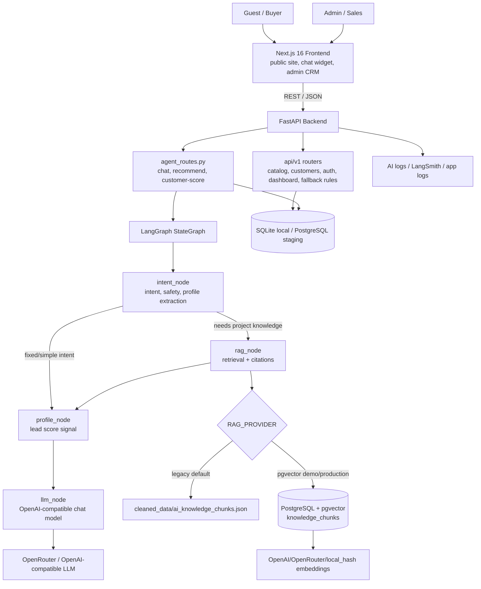
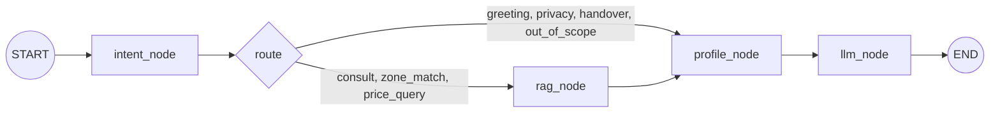
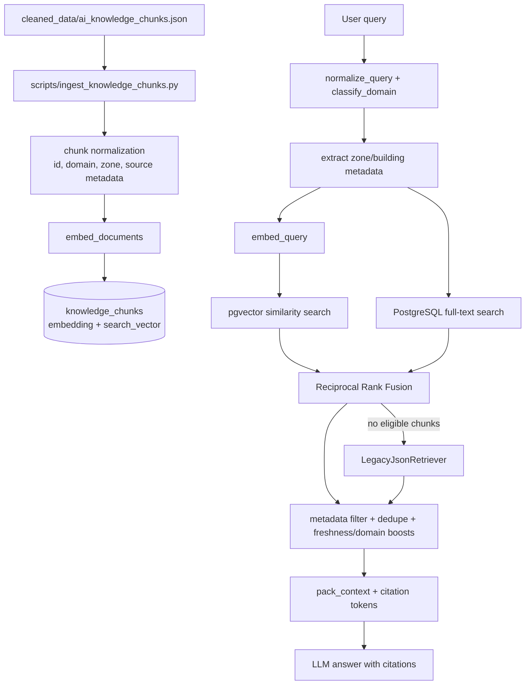

# Architecture Diagram

> Official architecture document for BTC: `ARCHITECTURE.md`. This file keeps the Mermaid diagrams as a lightweight companion.

## System Overview

## LangGraph Agent Flow

LangGraph hiện tại là custom advisory graph, không phải ReAct tool loop thuần. Mỗi node có một trách nhiệm:

- `intent_node`: phân loại intent, phát hiện prompt injection/off-topic/privacy/handover, trích xuất profile.
- `rag_node`: dựng `RetrievalQuery`, gọi retriever, pack context, trả citations/recommended zones.
- `profile_node`: cập nhật tín hiệu lead và khuyến nghị handover khi đủ ngưỡng.
- `llm_node`: sinh câu trả lời cuối cùng từ state, RAG context và citations; có fixed response cho intent không cần LLM.

## RAG Flow

Default local mode is `RAG_PROVIDER=legacy`, which uses chunked JSON retrieval without embeddings. Technical/demo mode is `RAG_PROVIDER=pgvector`, which follows the standard RAG pattern: chunk, embed, store in vector DB, retrieve top-k, pack context, then call LLM.

## Data Stores

| Store | Local | Staging/Production | Purpose |
|---|---|---|---|
| App DB | SQLite `app.db` | PostgreSQL | users, customers, conversations, messages, sales/admin data |
| RAG chunks | JSON fallback | PostgreSQL `knowledge_chunks` + pgvector | retrieval context and citations |
| Static project data | `data/`, `cleaned_data/` | seeded/ingested data | catalog and knowledge source |
| Logs | local log files | AI log server / LangSmith | demo evidence and observability |

## Deployment Notes

- Local backend uses sync SQLAlchemy. If `DATABASE_URL` is accidentally set to `postgresql+asyncpg://`, `src/db/session.py` normalizes it to `postgresql+psycopg://` for sync operations.
- pgvector retrieval still uses the async SQLAlchemy path for vector/full-text search.
- For production, run Alembic migrations and set `AUTO_CREATE_TABLES=false`.
