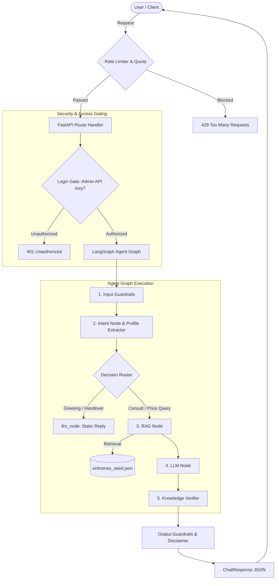

# Spec: AI Platform Enhancement — Pre-Sales Advisor Hardening

This specification outlines the requirements, architecture, acceptance criteria, and constraints for hardening the Ocean Park AI Advisor platform. It addresses core operational guardrails, hallucination prevention, fact verification, structured sales escalation, session management, security, rate limiting, and administrative gating.

---

## 1. Product Requirements Document (PRD)

### 1.1. User Stories & Business Scenarios

*   **As a Guest User**, I want to chat with the AI about Vinhomes Ocean Park zones, amenities, and price ranges without logging in, so that I can explore properties freely.
*   **As an Interested Buyer**, when I ask about specific unit codes (e.g., "Căn 12A tầng 15 tòa R1.01 còn không?"), I want the AI to politely redirect me to a Sales form, so that I can get real-time availability from a human.
*   **As a Sales Agent**, I want to see leads scored automatically (HOT, WARM, COLD) with reasoning based on budget and timeline, so that I can prioritize follow-up calls.
*   **As a System Administrator**, I want to protect the admin endpoints and enforce rate limiting/quotas, so that malicious actors cannot exhaust our LLM token budget or access proprietary lead data.

### 1.2. Feature Scope & Requirements

| Feature | Requirement Description | Priority |
| :--- | :--- | :--- |
| **1. Guardrails** | Filter out-of-scope topics (politics, other projects) and sanitize user input against injection. | Critical |
| **2. Hallucination Prevention** | Limit LLM temperature ($0.2 \le T \le 0.4$), bind responses strictly to retrieved context, and auto-inject price/policy disclaimers. | Critical |
| **3. Knowledge Verifier** | Cross-verify LLM responses against structured seed database entities (min/max price, area) and append warnings for `confidence_level: low` data. | High |
| **4. Sales Escalation** | Trigger `trigger_handover: true` when purchase intent (deposit, specific unit numbers) is detected, prompting lead capture. | Critical |
| **5. Chat History** | Persistent storage of messages mapped to user conversation threads. | High |
| **6. Session Management** | UUID-based session lifecycles for both guests and authenticated customers. | High |
| **7. Rate Limiting** | Limit API requests to 5 requests/minute per session/IP to block abuse. | High |
| **8. Quota Control** | Cap total chat messages to 100/day per IP/session to prevent token budget exhaustion. | Medium |
| **9. Login Gating** | Access control on admin endpoints (`/api/v1/leads`) via `X-Admin-Key` header token verification. | Critical |

---

## 2. Architecture & Design

### 2.1. System Data Flow Diagram

### 2.2. Database & State Schema Extensions

We extend the database mapping from SQLite/SQLAlchemy schema to fully track session status:

#### `conversations` Table
*   `id`: `UUID` (Primary Key)
*   `customer_account_id`: `UUID` (Nullable, references customer)
*   `session_id`: `String` (Indexed, tracks Guest / Customer session)
*   `last_intent`: `String` (e.g., "consult", "handover")
*   `daily_usage_count`: `Integer` (Counter reset daily for quota tracking)
*   `created_at`: `DateTime`
*   `updated_at`: `DateTime`

#### `messages` Table
*   `id`: `UUID` (Primary key)
*   `conversation_id`: `UUID` (Foreign key to conversations)
*   `role`: `Enum` ("user", "assistant", "system")
*   `content`: `Text` (Sanitized)
*   `created_at`: `DateTime`

---

## 3. Acceptance Criteria

### 3.1. Guardrails
*   **Input Sanity:** The system must reject input strings exceeding $10,000$ characters.
*   **Out of Scope:** If user mentions competitive projects (e.g., "Vinhomes Grand Park", "Times City") or non-real estate topics (e.g., "chính trị", "lịch sử"), the AI must respond with a default out-of-scope response: `"Tôi chỉ hỗ trợ thông tin về dự án Vinhomes Ocean Park Gia Lâm."`

### 3.2. Hallucination Prevention & Knowledge Verifier
*   **Strict Context:** The system prompt must instruct the model to use *only* the retrieved context. If information is not in the context, it must reply: `"Thông tin này hiện chưa được cập nhật. Vui lòng liên hệ Sales để biết thêm chi tiết."`
*   **Price Disclaimer:** Any response containing numbers followed by currency markers ("tỷ", "triệu/m2") must automatically have the disclaimer appended: `"\n\n*(Giá tham khảo theo dữ liệu Q1/2026. Vui lòng liên hệ Sales để xác nhận giá hiện tại.)*"`
*   **Low-Confidence Data:** If data used has `confidence_level == "low"`, the output must be prefixed with: `"[LƯU Ý THAM KHẢO]: Dữ liệu phân khu này chưa được chính thức xác nhận..."`

### 3.3. Sales Escalation & Lead Scoring
*   **Trigger Keywords:** Asking for specific apartments (e.g., "căn 05 tầng 10", "căn R1.01-1205") or expressing buying intent ("cọc giữ chỗ", "ký hợp đồng mua") must set `trigger_handover: true` and return a pre-sales escalation response.
*   **Lead Scoring Validation:** Submitting a lead with budget $\ge$ 2 Billion VND, a buying purpose, and a timeline within 3 months must log the lead as `HOT`. Missing budget or timeline drops the score to `WARM` or `COLD` accordingly.

### 3.5. Session & Security Gating
*   **Rate Limiting:** Sending $\ge 6$ requests within $60$ seconds from the same session ID must return `429 Too Many Requests`.
*   **Access Control:** Accessing `GET /api/v1/leads` or `GET /leads` without `X-Admin-Key` matching `settings.admin_api_key` must return `401 Unauthorized`.

---

## 4. Technical Constraints & Boundaries

### 4.1. Constraints
1.  **Latency Budget:** The complete LangGraph agent invocation (including RAG retrieval and LLM OpenRouter API call) must complete in $\le 5.0$ seconds under normal network conditions.
2.  **No Direct Shell/SQL execution:** No LLM-generated text can be passed directly to database query statements or shell execution commands.
3.  **PII Privacy:** Names, phone numbers, and email addresses must be masked (`0912***567`) in all persistent backend logs.
4.  **Local Storage only for dev:** Development uses SQLite (`data/vinhomes.db`). Production should support environment swaps to PostgreSQL via SQLAlchemy connection strings.

### 4.2. Operating Boundaries
*   **Always Do:**
    *   Parameterize database queries to avoid SQL Injection.
    *   Return standard JSON HTTP error payloads for validation failures.
    *   Audit-log all sales handovers.
*   **Ask First:**
    *   Modifying CORS configurations to allow external domains.
    *   Updating `admin_api_key` encryption strength.
*   **Never Do:**
    *   Hardcode API keys or credentials in code or `.env.example` templates.
    *   Allow bypass of rate limits for unauthorized users.
    *   Store raw passwords in plaintext.

---

## 5. Success Criteria & Verification Gates

### 5.1. Verification Checkpoints

*   **Gate 1: Guardrail & Policy Check:** Run integration test verifying that queries containing `"cọc giữ chỗ"` trigger `trigger_handover: true` and return `HANDOVER_RESPONSE`.
*   **Gate 2: Rate Limiter Validation:** Mock 6 rapid requests and verify `429` status code response.
*   **Gate 3: Auth Validation:** Test `GET /api/v1/leads` with an invalid API key, asserting `401 Unauthorized` code.
*   **Gate 4: Database Integrity:** Confirm that new sessions instantiate a `conversation` row in SQLite and subsequent chats reuse the same `session_id`.

---

## 6. Open Questions
1.  Should we track user quota by IP address or by cookies/session_id? *(Recommended: Track by session_id with IP fallback to prevent spoofing)*
2.  Do we support automated password reset flows for sales staff? *(Recommended: No, account creation and management is manual/admin-driven in phase 1)*
