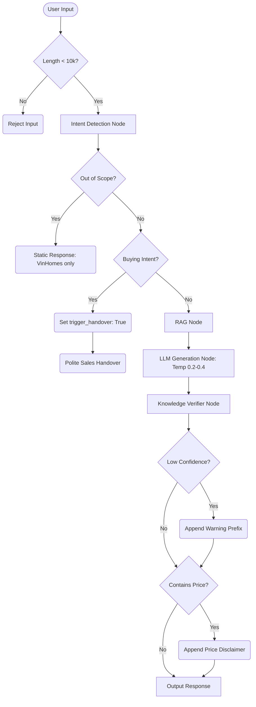

# Epic 1: AI Safety Design

## 1. Architectural Decision Record (ADR)

### Title: LangGraph-Based AI Safety & Guardrails Enforcement
**Status:** Accepted
**Context:** The AI Pre-Sales Assistant needs to handle real-estate inquiries safely without hallucinating or providing off-topic advice. We must ensure user prompts and generated outputs are sanitized and adhere strictly to VinHomes project details.
**Decision:** We decided to implement guardrails inside a LangGraph architecture. Safety checks are node-based.
- **Input Guardrails:** We enforce length checks and topic filters before invoking any LLM node. If out-of-scope, a static response is returned, short-circuiting the graph.
- **Knowledge Verifier:** Post-generation, the response is checked for "low confidence" data, and mandatory price disclaimers are appended via regex-based interception.
- **Sales Escalation:** Any high-intent queries set `trigger_handover=True`, bypassing standard consult loops and forcing a handover response.

**Consequences:** 
- *Positive:* Robust and scalable safety flow. Easy to unit test individual nodes.
- *Negative:* Slight latency overhead as text goes through multiple regex validations and checks.

---

## 2. Flow Diagram



---

## 3. State Changes

The LangGraph `AgentState` manages the contextual state of the safety features throughout an invocation.

| Field | Type | Description | State Transition |
| --- | --- | --- | --- |
| `query` | `str` | Raw user input | Initialized at start |
| `intent` | `str` | Detected user intent | `None` ➔ `"consult"` / `"handover"` / `"out_of_scope"` |
| `trigger_handover`| `bool`| Flag to initiate sales | `False` ➔ `True` if buying intent detected |
| `confidence` | `str` | Confidence level | `None` ➔ `"high"` / `"medium"` / `"low"` |

---

## 4. API Contracts

### LLM Node Generation Request (Internal)
**Endpoint:** `POST /api/v1/chat`

**Request Body:**
```json
{
  "message": "Căn 12A R1.01 còn không?",
  "session_id": "uuid-1234"
}
```

**Response (Handover Triggered):**
```json
{
  "response": "Dạ, để kiểm tra giỏ hàng thực tế cho căn 12A R1.01, anh/chị vui lòng để lại thông tin để chuyên viên hỗ trợ ạ.",
  "intent": "handover",
  "trigger_handover": true,
  "confidence_level": "high"
}
```

**Response (Out of Scope):**
```json
{
  "response": "Tôi chỉ hỗ trợ thông tin về dự án Vinhomes Ocean Park Gia Lâm.",
  "intent": "out_of_scope",
  "trigger_handover": false,
  "confidence_level": "high"
}
```
