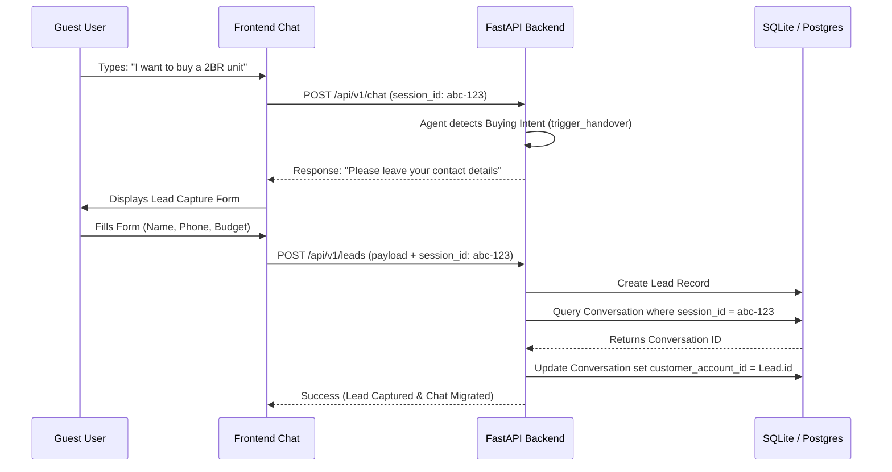

# Epic 3: Lead Capture Design

## 1. Architectural Decision Record (ADR)

### Title: Seamless Lead Conversion & Admin Gating
**Status:** Accepted
**Context:** Users begin interacting with the AI as anonymous guests to reduce friction. Once a user exhibits buying intent or is ready to consult a human agent, they must be converted into a Lead. We need to preserve their anonymous chat history and link it to their new Lead profile. Furthermore, the Lead data must be protected from unauthorized access.
**Decision:** 
- **Anonymous Sessions:** Initiated via a client-generated UUID `session_id`.
- **Session Migration:** Upon lead submission (`POST /api/v1/leads`), the system locates the `Conversation` matching the `session_id` and binds it to the newly created Lead.
- **Login Gating (Admin):** Retrieving leads (`GET /api/v1/leads`) requires an `X-Admin-Key` header. This protects PII and sales data from public exposure.

---

## 2. Lead Conversion Flow Diagram



---

## 3. Login Gate & OAuth Readiness

### Current Implementation (Login Gate)
We use an API Key Strategy for immediate security.
- **Header:** `X-Admin-Key: <secret_token>`
- **Middleware/Dependency:** `verify_admin_key` validates the header against `settings.admin_api_key`.
- **Failure:** Returns `401 Unauthorized`.

### Future OAuth Integration
For integrating with VinHomes enterprise SSO or internal tools:
- Replace `X-Admin-Key` with a JWT Bearer Token validation (`Authorization: Bearer <token>`).
- Use OAuth2 with Scopes (e.g., `leads:read`, `leads:write`).
- Tie identities to Sales Staff Profiles rather than a single global admin key.

---

## 4. API Contracts

### Create Lead (Lead Conversion)
**Endpoint:** `POST /api/v1/leads`

**Request Body:**
```json
{
  "name": "Nguyen Van A",
  "phone": "0912345678",
  "email": "nva@example.com",
  "budget_min": 2000000000,
  "budget_max": 3000000000,
  "timeline_months": 3,
  "purpose": "buy",
  "notes": "Quan tâm căn 2PN",
  "session_id": "uuid-1234"
}
```

**Response (200 OK):**
```json
{
  "id": "lead-uuid-4567",
  "name": "Nguyen Van A",
  "score": "HOT",
  "status": "new",
  "created_at": "2026-06-18T10:00:00Z"
}
```

### Fetch Leads (Admin Gated)
**Endpoint:** `GET /api/v1/leads`
**Headers:**
- `X-Admin-Key`: `your-secure-admin-key`

**Response (200 OK):**
```json
[
  {
    "id": "lead-uuid-4567",
    "name": "Nguyen Van A",
    "phone": "0912***678",
    "score": "HOT"
  }
]
```
