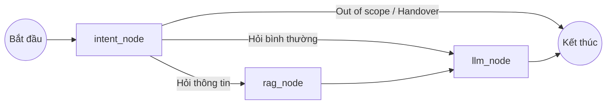

# Ocean Park AI Advisor - RAG Chatbot Pipeline (Compact)

Tài liệu này tóm tắt kiến trúc và quy trình hoạt động của hệ thống Chatbot AI (tư vấn bất động sản) được thiết kế dựa trên LangGraph, FastAPI, và cơ chế RAG (Retrieval-Augmented Generation). 

Bạn có thể sử dụng nguyên văn tài liệu này làm **Context (Ngữ cảnh)** để cung cấp cho bất kỳ phiên bản AI nào khác khi cần hỗ trợ code, debug hoặc phân tích dự án.

---

## 1. Kiến trúc tổng quan (Agent Workflow)

Hệ thống hoạt động dưới dạng một **State Machine** (được điều phối bởi thư viện `LangGraph`) gồm 3 nút (node) chính chạy tuần tự và có rẽ nhánh điều kiện:

### 🧠 Cấu trúc AgentState (Dữ liệu truyền qua các Node)
Mỗi chu kỳ hội thoại, một đối tượng `AgentState` được truyền đi bao gồm:
- `messages`: Lịch sử trò chuyện.
- `user_profile`: Ngân sách (budget), nhu cầu (purpose), loại căn (unit_type), timeline.
- `intent`: Ý định của khách (`consult`, `price_query`, `zone_match`, `out_of_scope`, `handover`, v.v.).
- `trigger_handover`: Cờ boolean (Bật lên nếu cần gọi Sales).
- `zone_context`: Chuỗi văn bản chứa thông tin RAG đã được lấy ra từ Database/JSON.
- `recommended_zones`: Danh sách các phân khu AI khuyên chọn.

---

## 2. Chi tiết các Node xử lý (Nodes Definition)

### A. Intent Node (`intent_node.py`)
- **Nhiệm vụ:**
  1. Phân tích tin nhắn mới nhất để phân loại ý định (Intent Classification).
  2. Trích xuất thông tin khách hàng (Extract User Profile) cập nhật vào State (ví dụ: bóc tách số tiền 3 tỷ thành `budget: 3000000000`).
  3. **Security:** Kiểm tra bằng Regex (Prompt Injection Filter). Nếu khách hàng cố tình chọc phá hệ thống (ví dụ: "bỏ qua các chỉ dẫn trước đây"), node này sẽ chặn ngay lập tức.
- **Đầu ra:** Gán `intent` và cập nhật `user_profile` vào State.

### B. RAG Node (`rag_node.py`)
- **Nhiệm vụ:** Hoạt động như một cỗ máy tìm kiếm.
  1. Nếu `intent` yêu cầu tư vấn phân khu, Node sẽ lấy dữ liệu từ `vinhomes_real.json` và `cleaned_apartment_zones.json`.
  2. **Scoring Logic:** Chấm điểm mức độ phù hợp của từng phân khu so với `user_profile` (Ngân sách có khớp giá min/max không? Loại căn có sẵn không? Mục đích ở thực hay đầu tư?).
  3. Chọn ra tối đa 3 phân khu điểm cao nhất (Top 3) và định dạng chúng thành văn bản thô (Plain text).
- **Đầu ra:** Ghi chuỗi văn bản thông tin vào biến `zone_context` của State.

### C. LLM Node (`llm_node.py`)
- **Nhiệm vụ:** Tổng hợp và sinh ra câu trả lời cuối cùng để gửi cho khách.
- **Quy tắc (System Prompt Rules):**
  1. Tuyệt đối không tự bịa thông tin. Nếu không có trong `zone_context`, yêu cầu liên hệ Sales.
  2. Tuyệt đối không tư vấn mã căn cụ thể, không cam kết quỹ căn, không chốt giá cuối (phải có chữ "Giá tham khảo").
  3. **Citations (Trích dẫn):** Nếu lấy thông tin tiện ích/giá từ một phân khu trong RAG context, bắt buộc tạo Markdown link trỏ đến URL phân khu đó dạng `[tên hoặc số](/phan-khu/<slug>)`.
- **Đầu ra:** Nội dung câu trả lời hoàn chỉnh (dạng Markdown) hoặc các câu hardcode như `GREETING_RESPONSE`, `HANDOVER_RESPONSE`.

---

## 3. Hệ thống phụ trợ: AI Lead Scorer (`lead_scorer.py`)

Đây là luồng chạy nền (background) độc lập khi người dùng điền thông tin vào Form Liên Hệ (`POST /api/v1/leads`).
- **Nhiệm vụ:** Gửi toàn bộ `chat_history` và `user_profile` cho LLM để chấm điểm mức độ tiềm năng.
- **Rubric Chấm Điểm:**
  - **HOT:** Có ngân sách $\ge$ 2 tỷ + mục đích cụ thể + timeline muốn mua sớm.
  - **WARM:** Có ngân sách/mục đích, đang cân nhắc, chưa có timeline.
  - **COLD:** Chưa có kế hoạch rõ ràng hoặc ngân sách quá thấp.
- **Fallback Rule:** Nếu LLM chết (Timeout/Error), hệ thống tự kích hoạt Rule-based (thuật toán dùng `IF/ELSE`) để chấm điểm, tránh rớt Lead của Sales.
- **Output:** Dữ liệu đẩy thẳng vào Database và hiển thị lên giao diện **Admin CRM Ticket**.
